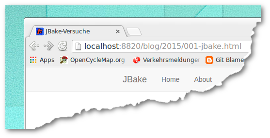

title=JBake-Versuche
date=2015-01-31
type=post
tags=blog
status=published
~~~~~~

JBake
=====

Heute habe ich ein wenig mit [JBake](http://jbake.org) herumgespielt. Möglicherweise wird das als Ersatz für meine [Octopress](http://octopress.org)-Installation dienen.

[Grain](http://sysgears-com/grain) sieht optisch fast ein wenig besser aus, allerdings scheint es nicht ganz so verbreitet zu sein wie JBake.

Start
------------

* JBake-2.3.2 herunterladen und installieren
* Neues Verzeichnis anlegen: uli-jbake
* Reinwechseln
* `jbake -i groovy`
* `jbake`
* `jbake -s`
* <http://localhost:8820/> zeigt den Beispielinhalt an

### Optional: Eigene Version bauen

* Maven3 installieren
* JBake klonen von GitHub: `git clone git@github.com:jbake-org/jbake.git`
* `cd jbake`
* `mvn package`
* Die erzeugte Version liegt dann im Verzeichnis "dist"

Erster Artikel
--------------

* `cp content/blog/2013/second-post.md content/blog/2015/001-jbake.md`
* Editieren von "content/blog/2015/001-jbake.md"
* Speichern
* `jbake`
* `jbake -s`
* <http://localhost:8820/> zeigt den ersten Artikel an

Beispielartikel entfernen
-------------------------

* `git rm -f content/blog/2013`
* `jbake`
* `jbake -s`
* <http://localhost:8820/> zeigt nur noch den ersten Artikel an

Titel
-----

Als Titel im Browser-Fenster wird das Feld "title" der Metadaten des aktuellen Artikels angezeigt:

```
title=JBake-Versuche
...
```



Mini-Icon ersetzen
------------------

* dpicon.png kopieren nach ./assets/dpicon.png
* Editieren von templates/header.gsp: favicon.ico -> dpicon.png
* `convert assets/dpicon.png ./assets/favicon.ico`
* `jbake`
* `jbake -s`
* <http://localhost:8820/> ... Firefox zeigt nun das neue Bildchen an, Chrome bleibt beim alten!

Bild-Ablage
-----------

Normalerweise müssen bei JBake die Bilder unterhalb von "/assets/images" abgelegt werden. Das passt mir persönlich garnicht, weil ich üblicherweise meine MD-Dateien mit relativen Bildpfaden versehe. Dazu müssen die Bilder dann bspw. unter content/blog/2015/images liegen. Leider kopiert JBake diese Bilder dann nicht in den "output"-Ordner, so dass sie via Browser nicht angezeigt werden können.

Abhilfe: Eigenes Skript namens "uli-jbake.sh", welches auch alle Bild-Dateien von "content" nach "output" kopiert.

Markdown-Umbruch
----------------

Mir persönlich gefallen die langen Zeilen
in vielen Markdown-Dokumenten überhaupt nicht.
Ich bevorzuge "kurze Zeilen", deren Umbruch beim
Markdown-HTML-Rendern ignoriert wird. Für einen
Absatz füge ich dann Leerzeilen ein.

Aktivieren kann man das via "markdown.extensions" in "jbake.properties".

* markdown.extensions=HARDWRAPS,AUTOLINKS,FENCED_CODE_BLOCKS,DEFINITIONS ... Standard-Einstellungen bei jbake-2.3.2
* markdown.extensions=ALL,-HARDWRAPS ... geht nur mit "meiner" Version von jbake-2.3.2

Bestehende JBake-Sites
----------------------

* <http://clairtonluz.github.io/> - Quellen: <https://github.com/clairtonluz/tp_blog>
  Verwendet Groovy-Templates
* <http://www.crashub.org/> - Quellen: https://github.com/crashub/crashub.github.com/tree/site
  Sieht optisch sehr hübsch aus - fast so hübsch wie Grain
* <http://www.ybonnel.fr/index.html> - Quellen: <https://github.com/ybonnel/blog>
  Schlicht, aber "breit"
* <http://jdpgrailsdev.github.io/blog/index.html>
  Interessanter Inhalt
