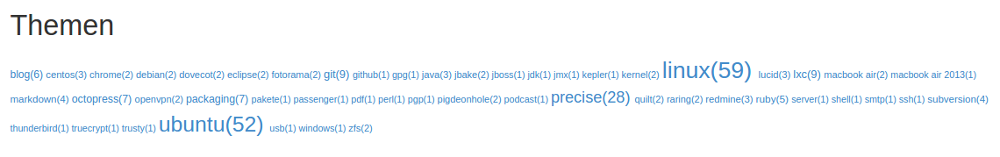
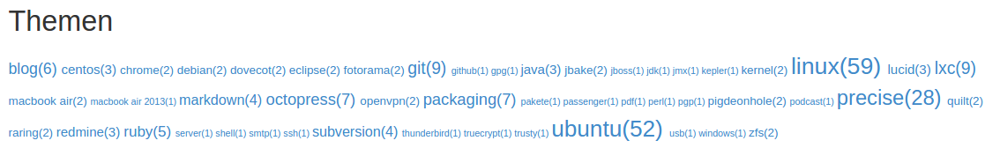

title=JBake: Schriftgröße bei der TagCloud
date=2015-06-11
type=post
tags=blog,jbake
status=published
~~~~~~

JBake: Schriftgröße bei der TagCloud
====================================

Ich habe für JBake eine selbst-implementierte TagCloud im Einsatz.
Nun ja: Viel zu implementieren gab's eigentlich nicht. Zählen der
Artikel pro Thema und Übergabe an i2ui ist eigentlich schon alles.

Per Standard sieht die TagCloud dann so aus:

Man sieht drei Begriffe relativ exponiert und alle anderen sind
mickrig klein. Das passt mir garnicht - ich hätte die Begriffe
gerne "gleichartiger".

Also: Statt dem richtigen Zählwert übergebe ich log10(Zählwert)
an i2ui. Dann sieht's so aus:

Für mich eine wesentliche Verbesserung!
