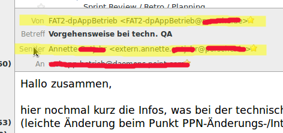

type=post
author=Uli Heller
status=published
title=Thunderbird: Anzeige vom "Sender"
date=2017-01-14 10:00
comments=true
tags=thunderbird
~~~~~~

Problem
-------

Ich bekomme häufig Mails, bei denen der Absender eine Gruppe ist, also bspw:

* `From: operating@stuttgart.de`

Dieses Feld wird dann als Adressat für meine Antworten verwendet.
Nichts desto trotz wurde die Mail ja nicht von der Gruppe verfasst, sondern von
einem Mitglied der Gruppe, bspw. "Egon Mayer". Das kann ich in Thunderbird
aber nicht erkennen.

Abhilfe
-------

* Bearbeiten - Einstellungen
* Allgemein - Konfiguration bearbeiten
* Suchen nach: mailnews.header.showSender
* Ändern von "false" auf "true"
* Thunderbird neu starten

Nun sieht so eine Nachricht grob so aus:

Links
-----

* [Sender in Kopfzeilenansicht](https://www.thunderbird-mail.de/thread/44797-tipp-tb-3-in-normaler-kopfzeilenansicht-sender-anzeigen/)
