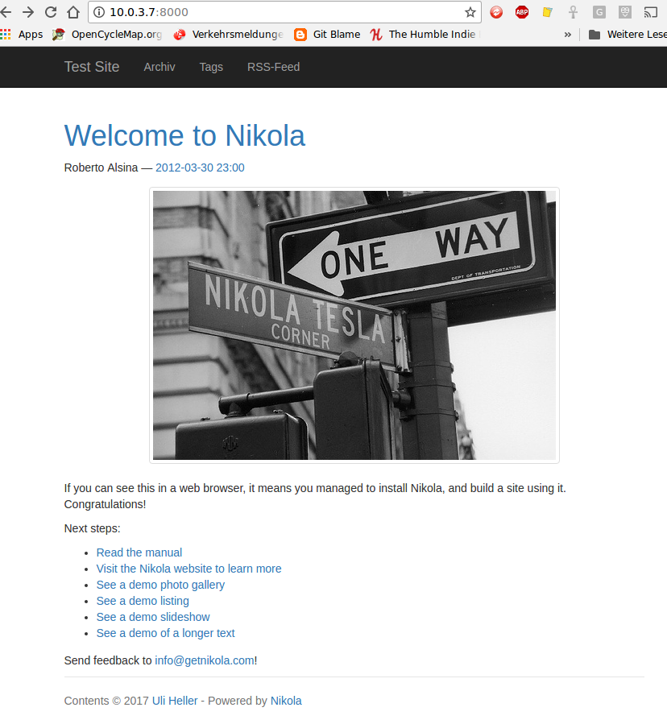

Nikola
======

Link: [Nikola](https://getnikola.com/)

Grundinstallation
-----------------

### LXC-Container erstellen

* Ausgangspunkt: LXC-Container "ubuntu1604-64"
* Kopie erstellen: `sudo lxc-copy -s -n ubuntu1604-64 -N nikola`
* Starten: `sudo lxc-start -d -n nikola`

### Abhängigkeiten installieren

```
lxc-nikola$ sudo apt-get install virtualenv
lxc-nikola$ sudo apt-get install language-pack-de
lxc-nikola$ sudo apt-get install rsync
# installs virtualenv for python3 on ubuntu1604
```

### Nikola installieren

```
lxc-nikola
$ virtualenv -p python3 nikola
$ cd nikola
$ source bin/activate
$ pip install --upgrade setuptools pip
$ pip install --upgrade "Nikola[extras]"
```

### Nikola aktualisieren

Beispielsweise von nikola-7.8.8 auf 7.8.9:

```
lxc-nikola
$ cd nikola
$ source bin/activate
$ pip install --upgrade setuptools pip
$ pip install --upgrade "Nikola[extras]"
```

### Kurztest

Im LXC-Container:

```
lxc-nikola
$ ~/nikola/bin/nikola init --demo testsite
$ cd testsite
$ ~/nikola/bin/nikola build
$ ~/nikola/bin/nikola serve
...
[2017-06-18T05:25:55Z] INFO: serve: Serving HTTP on 0.0.0.0 port 8000...
```

Browser: http://10.0.3.7:8000



#### material-theme

Im LXC-Container:

```
lxc-nikola
$ cd ~/testsite
$ ~/nikola/bin/nikola theme -i material-theme
# Edit conf.py: THEME = "material-theme"
$ ~/nikola/bin/nikola build
$ ~/nikola/bin/nikola serve
```

Browser: http://10.0.3.7:8000


#### cadair-theme

Im LXC-Container:

```
lxc-nikola
$ cd ~/testsite
$ ~/nikola/bin/nikola theme -i cadair
# Edit conf.py: THEME = "cadair"
$ ~/nikola/bin/nikola build
$ ~/nikola/bin/nikola serve
```

Browser: http://10.0.3.7:8000


THEME_COLOR in conf.py hat keine Auswirkung auf die Darstellung!

#### cadair-dp

Im LXC-Container:

```
lxc-nikola
$ cd ~/testsite
$ cp -a themes/cadair themes/cadair-dp
# Edit conf.py: THEME = "cadair-dp"
$ ~/nikola/bin/nikola build
$ ~/nikola/bin/nikola serve
```

Nikola-Site
-----------

[Download](https://github.com/getnikola/nikola-site/archive/master.zip)
