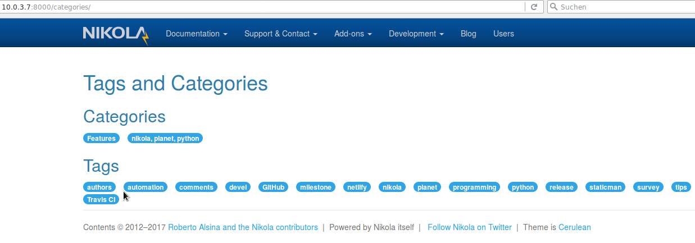
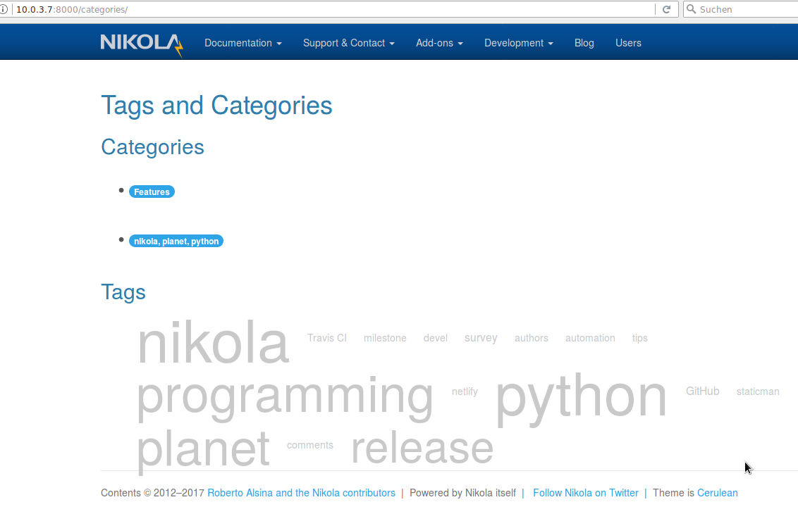

Eine TagCloud in Nikola
=======================

Ausgangspunkt
-------------

* Funktionierende Grundinstallation von Nikola in einem LXC-Container
* Kopie von [nikola-site-master](https://github.com/getnikola/nikola-site)

Kurztest Nikola
---------------

```
# lxc-container
$ cd nikola-site-master
$ ~/nikola/bin/nikola build
$ ~/nikola/bin/nikola serve
```

Im Browser: http://10.0.3.7:8000/categories -> Standard-Liste der "Categories" und "Tags" wird angezeigt



Plugin installieren
-------------------

```
# lxc-container
$ cd nikola-site-master
$ ~/nikola/bin/nikola plugin -i tx3_tag_cloud
$ mkdir themes/cerulean/templates
$ cp plugins/tx3_tag_cloud/templates/mako/tags.tmpl themes/cerulean/templates/.
```

Test
----

```
# lxc-container
$ cd nikola-site-master
$ ~/nikola/bin/nikola build
$ ~/nikola/bin/nikola serve
```

Im Browser: http://10.0.3.7:8000/categories -> TagCloud wird angezeigt


